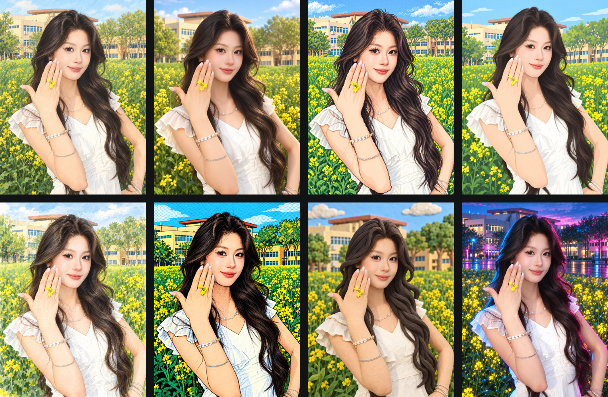

# PaiShu · 一图多绘

<p align="center"><a href="./README.md"><strong>English</strong></a></p>

一个面向 Codex 的图片风格重绘 Skill：将同一张人物或场景照片转换为 8 种适合小红书与 X 分享的视觉风格，同时尽量保留人物辨识度、姿势、服装、手部和原始构图。



## 核心能力

- 严格锁定人物身份、年龄、脸型、发型、表情、姿势和手部结构。
- 提供 8 个经过实图测试的稳定预设。
- 支持单一风格生成、完整八风格对比和智能风格推荐。
- 默认生成兼容小红书与 X 的 3:4 竖图。
- 每个风格独立生成，避免拼图生成导致的画质下降。
- 自动检查身份漂移、额外手指、服装变化、随机文字和比例偏移。
- 附带图片尺寸、比例和 5 MB 文件大小验证脚本。

## 八种正式风格

| ID | 中文名称 | 适用场景 |
| --- | --- | --- |
| `soft-cel-editorial` | 柔和手绘动画 | 生活方式、旅行、人像 |
| `rounded-3d-character` | 圆润电影感 3D | 个人品牌、头像、轻松内容 |
| `retro-pixel` | 复古像素 | 科技、游戏、怀旧内容 |
| `flat-social-illustration` | 扁平社媒插画 | 教程、产品、知识分享 |
| `watercolor-journal` | 水彩旅行手帐 | 旅行、美食、生活记录 |
| `pop-halftone-comic` | 波普网点漫画 | 观点、发布、强视觉内容 |
| `matte-clay` | 哑光黏土 | 趣味叙事、亲和品牌表达 |
| `neon-cyber` | 赛博霓虹 | AI、软件、科技与夜景 |

## 安装

将仓库克隆到 Codex Skills 目录：

```bash
git clone https://github.com/kankanliuyi-lgtm/paishu-image-remix.git ~/.codex/skills/paishu-image-remix
```

重新开始一个 Codex 会话后，使用：

```text
$paishu-image-remix
```

## 使用示例

完整八风格对比：

```text
使用 $paishu-image-remix，把这张照片生成完整的八风格对比图。严格保留人物身份、姿势、服装和手部，输出适合小红书与 X 的 3:4 图片。
```

生成单一风格：

```text
使用 $paishu-image-remix，将这张照片转换为 watercolor-journal 风格，身份优先级 strict，保留原始构图，不添加文字。
```

让 Skill 推荐风格：

```text
使用 $paishu-image-remix，根据照片内容为小红书推荐最合适的风格并生成图片。
```

## 工作方式

1. 识别照片中的身份、姿势、服装、手部、主体位置和背景地标。
2. 根据内容与平台选择预设，或按固定顺序生成八种风格。
3. 每个风格调用一次图片编辑能力，并重复身份与构图约束。
4. 逐张检查结果；单张最多进行一次定向纠偏。
5. 保存独立成品，并验证比例和文件大小。

详细规则见 [`SKILL.md`](SKILL.md)，完整风格配方见 [`references/style-presets.md`](references/style-presets.md)。

## 输出建议

- 小红书与 X 通用：3:4 竖图，建议导出约 1080 × 1440。
- 风格测试阶段不要在图片中直接生成标题或说明文字。
- 发布 AI 生成或编辑图片时，请遵守对应平台的内容标识规则。
- `scripts/validate-social-image.sh` 使用 macOS 的 `sips` 检查图片，属于可选辅助脚本。

## 项目结构

```text
paishu-image-remix/
├── SKILL.md
├── agents/openai.yaml
├── assets/style-board.png
├── references/
│   ├── platform-output.md
│   └── style-presets.md
└── scripts/validate-social-image.sh
```

## English summary

**PaiShu Image Remix** is a Codex Skill that turns one portrait or scene into eight identity-preserving visual styles for Xiaohongshu and X. It supports single-preset generation, full style comparisons, preset recommendations, strict face/pose/hand preservation, and practical 3:4 output validation.

Invoke it with `$paishu-image-remix` after installation.
